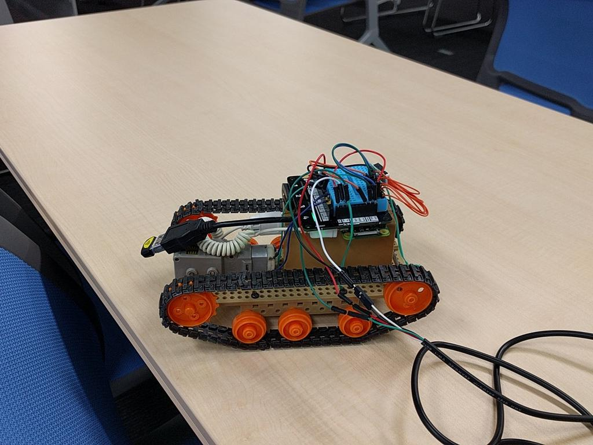

## Python で GPIO 操作

鈴木光宏(@s_mitu)

---

## 自己紹介
## 

* 鈴木光宏(@s_mitu) 
 * なんちゃって組み込み系(i386系 CPU でFreeBSD/Linux 入れて動く機械を作る)
 * 最近は arm 系も(Linuxですが)
 * マヌルネコとダム画像ばかり流れてくる twitter アカウント @s_mitu

---

## Raspberry Pi といえば Python

* Pi = Python だとか
* Raspbian では GPIO など低レベルを叩けるライブラリが充実
* FreeBSD で使う分には関係ない。
* でも高級言語と充実したライブラリは魅力

---

## GPIO 操作用 Python + FreeBSD ライブラリ

* freebsd-gpio https://github.com/gonzoua/freebsd-gpio
 * FreeBSD wiki (https://wiki.freebsd.org/FreeBSD/arm/Raspberry%20Pi) からリンク
 * Perl/Ruby/Python のライブラリ
 * Pythonライブラリは下の方がメンテがアクティブですよと勧められる
* fbsd_gpio_py https://github.com/evadot/fbsd_gpio_py
 * 今回はこちらを利用

---

## インストール
* まず cffi を pkg でインストール
 * pkg install py27-cffi
* ソースを取ってくる git clone https://github.com/evadot/fbsd_gpio_py.git
 * README.rst に従い pip でインストール
 * コケる
 * コンパイラとかが /nxb-bin/usr/bin/cc とか見ちゃってる
 * 環境変数でも切り替わらず /nxb-bin を作るという強行手段でインストール

--- 

## 使い方
* README.rst のサンプルが微妙に違うので注意

---
## 他のライブラリと組み合わせ
* WebAPIをFlas(khttp://flask.pocoo.org)で実装
 * HTTPでGPIOが叩けるようになる

* Webから操作出来るリモコンを作ってみよう

---
## 用意したハードウェア
* Raspberry Pi
* Pimoroni Explorer Hat Pro(https://shop.pimoroni.com/products/explorer-hat)
 * Proじゃないとモーター制御がない
* タミヤの工作キット（トラック＆ホイールセット　ギアボックス）
 * モーター一つで前進後退のみ
* オマケで距離センサー（I2C）
---
## ハードウェア制御
* モーター制御
 * GPIOで操作（https://github.com/pimoroni/explorer-hat/blob/master/documentation/Technical-reference.md)

---

## 実演

